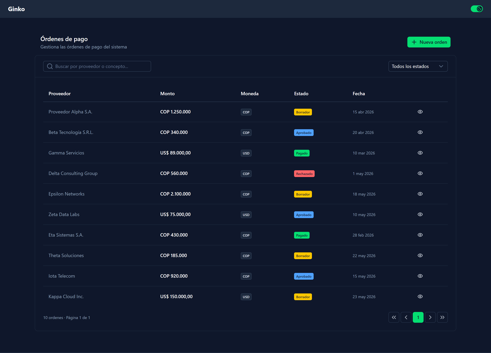
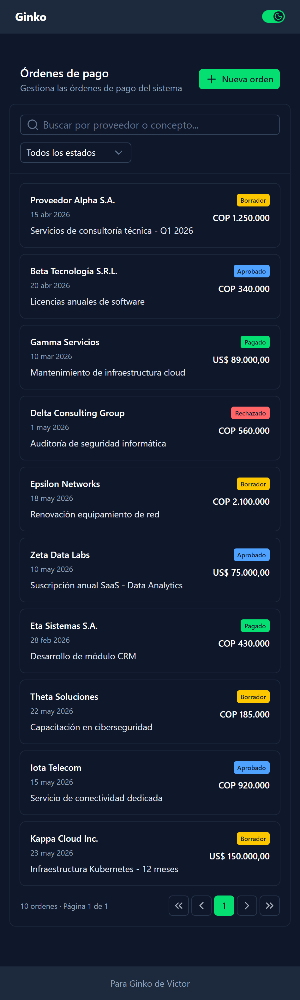

# Ginko Payment Management

Aplicación SPA para la gestión de órdenes de pago a proveedores. Desarrollada como prueba técnica para **Ginko** (banca empresarial).

Permite listar, crear, visualizar y transicionar órdenes de pago a través de un flujo de estados (Borrador → Aprobada → Pagada / Rechazada), con feedback visual, validación de formularios, diseño responsivo y modo oscuro.

---

## Capturas

| Desktop | Mobile |
|---|---|
|  |  |

---

## Stack Tecnológico

| Dependencia | Versión | Propósito |
|---|---|---|
| Vue 3 | ^3.5.13 | Framework base con Composition API |
| Vite | ^5.0.0 | Bundler y dev server |
| vue-router | ^5.0.7 | Rutas SPA con lazy loading |
| Pinia | ^3.0.4 | Estado global de UI (filtros, paginación) |
| Nuxt UI | ^4.8.0 | 125+ componentes Vue con Tailwind theming |
| Tailwind CSS | ^4.3.0 | Utilidades CSS y diseño responsivo |
| Zod | ^3.24.2 | Validación de esquemas en formularios |
| Vitest | ^3.1.1 | Framework de tests unitarios e integración |
| @vue/test-utils | ^2.4.6 | Utilidades de testing para Vue |
| jsdom | ^26.0.0 | Entorno DOM para tests |
| @formkit/auto-animate | ^0.9.0 | Animaciones automáticas en listas |

---

## Requisitos Previos

- **Node.js** >= 18 (recomendado 20 LTS)
- **npm** >= 9

---

## Instalación y Ejecución

```bash
# Clonar el repositorio
git clone <repo-url>
cd ginko-payment-management

# Instalar dependencias
npm install
```

### API Mock

La aplicación funciona completamente con datos mock. No requiere un backend externo.

Los datos se sirven desde `public/mock/orders.json` y Vite los expone estáticamente en `/mock/orders.json`. Internamente, `provider-orders.js` cachea los datos en memoria y persiste los cambios en `localStorage`, lo que permite crear y transicionar órdenes durante la sesión.

### Aplicación

```bash
# Entorno de desarrollo (hot-reload)
npm run dev

# Build de producción
npm run build
```

La aplicación arranca en `http://localhost:5173` por defecto.

---

## Pruebas

```bash
# Ejecutar tests una vez
npm test

# Modo watch (para desarrollo)
npm run test:watch
```

Los tests se encuentran en `src/modules/**/__tests__/*.spec.js` y abarcan:

- **Validación del schema Zod**: todas las reglas de negocio (campos requeridos, rangos, longitud mínima/máxima).
- **Integración del formulario**: flujo completo de creación (submit válido, error en API, cancelación).

---

## Decisiones de Diseño

### Arquitectura de Componentes (ABCD+L)

Este proyecto introduce un sistema propio de organización de componentes llamado **ABCD+L**, diseñado para mantener predecible la ubicación y responsabilidad de cada componente global.

#### El problema

En proyectos Vue sin una convención clara, los componentes globales terminan mezclados: algunos son wrappers mínimos de librerías externas, otros contienen lógica compleja, y no hay forma de saber su alcance solo por el nombre. Esto escala mal cuando el equipo y la aplicación crecen.

#### La solución: ABCD+L

Definí una jerarquía de **5 categorías** con prefijos obligatorios en el nombre del archivo. Cada categoría tiene una responsabilidad única y reglas estrictas de dependencia:

| Categoría | Prefijo | Carpeta | Responsabilidad | Regla clave |
|---|---|---|---|---|
| **Atom** | `A` | `a/[tipo]/` | Elemento UI indivisible. Un div con estilos, un wrapper mínimo. No tiene sentido fuera de un contexto. | No contiene lógica ni estado. |
| **Base** | `B` | `b/[tipo]/` | Wrapper sobre un componente de librería externa (Nuxt UI). Estandariza estructura, props y comportamiento. Puede usarse directamente pero existe para ser extendido. | Solo wrappeo, sin lógica de negocio. |
| **Composite** | `C` | `c/[tipo]/` | Especialización semántica de un Base. Bloquea props específicas (p. ej., color fijo en `error`) para forzar un patrón de diseño. | Hereda de un Base, hardcodea props. |
| **Design** | `D` | `d/[tipo]/` | Estructura compleja autónoma compuesta de Atoms, Bases o Composites. Puede tener lógica de UI interna (mostrar/ocultar, animar) pero nunca de negocio. | Sin API calls, sin Pinia. |
| **Layout** | `L` | `l/` | Scaffolding de página (header, footer, sidebar). Define la cáscara visual de las vistas. | Sin lógica, solo estructura. |

**Regla fundamental**: Los componentes Core (A, B, C, D, L) **NUNCA** contienen lógica de negocio, llamadas a API ni mutaciones a stores de Pinia. Si un componente necesita eso, es un Feature Component y vive en un módulo específico.

#### Ejemplos del proyecto

| Componente | Categoría | ¿Qué hace? |
|---|---|---|
| `ACardInner` | Atom | Un `<div>` con `p-4` y bordes estandarizados. |
| `BBadge` | Base | Wrapper de `<UBadge>` de Nuxt UI con mapa de colores. |
| `BCard` | Base | Wrapper de `<UCard>` con `p-0` en el body por defecto. |
| `BModal` | Base | Wrapper de `<UModal>` con soporte para formularios, slots condicionales y modo bloqueante. |
| `CBadgeStatus` | Composite | `BBadge` preconfigurado con colores semánticos para estados de orden (Borrador, Aprobada, etc.). |
| `CModalDanger` | Composite | `BModal` con color `error` y modo bloqueante para acciones destructivas. |
| `DActionButtons` | Design | Par primario + secundario de botones con separación visual. |
| `DCardHeader` | Design | Header de card con título, subtítulo, botón de retroceso y slot de acciones. |
| `LHeader` | Layout | Barra superior con logo, navegación y modo oscuro. |
| `LFooter` | Layout | Pie de página informativo. |

#### Componentes de módulo (Feature)

Los módulos de funcionalidad usan una convención diferente, sin prefijos A/B/C/D/L:

| Tipo | Carpeta | Ejemplo | Responsabilidad |
|---|---|---|---|
| `Section` | `components/section/` | `SectionOrderList.vue` | Orquestador: llama composables, compone bloques de UI |
| `Form` | `components/form/` | `FormCreateOrder.vue` | Smart form con validación y envío |
| `Fields` | `components/fields/` | `FieldsOrderForm.vue` | Dumb fields presentacionales |
| `Table` | `components/table/` | `TableOrderList.vue` | Tabla responsiva con datos |
| `Card` | `components/card/` | `CardOrderMobile.vue` | Presentación individual mobile |

---

### Arquitectura de API (5 Capas)

Implementé una **Anti-Corruption Layer** de 5 niveles para separar totalmente el consumo de API del UI:

```
Cliente → Provider → Service → Composable → UI
```

1. **Cliente** (`client-fetch.js`): Wrapper de `fetch()` nativo con manejo de errores centralizado. Es la única capa que conoce el mecanismo de transporte HTTP.
2. **Provider** (`provider-orders.js`): Operaciones CRUD contra el origen de datos (mock JSON + localStorage). Recibe una señal `AbortController` para cancelación.
3. **Service** (`service-orders.js`): Capa de paso que recibe el provider por inyección de dependencias. Preparada para validar esquemas con Zod (futuro `utilCheckResponseSchema`).
4. **Composable** (`use-list-orders.js`, `use-create-order.js`, etc.): Inyecta el provider en el service y expone hooks reactivos (`useFetch` / `useMutation`) para los componentes.
5. **UI** (Section, Page): Consume composables. Nunca llama a providers ni a fetch directamente.

**Beneficio**: Si el origen de datos cambia (mock → API real), solo se modifica el Provider. Ningún componente Vue se ve afectado.

---

### Arquitectura Page → Section

Las páginas son **orquestadores delgados** y las secciones son **contenedores de funcionalidad**:

- **Page** (`PaymentOrderListPage.vue`): Renderiza secciones con margen entre ellas (`mb-8`), maneja navegación (`router.push`). Sin lógica de datos.
- **Section** (`SectionOrderList.vue`): Llama a composables, maneja filtros y estado. Compone la UI con componentes más pequeños.
- Los composables se llaman dentro de Section, no en Page. El espaciado entre secciones se maneja a nivel Page (no dentro de Section).

**Beneficio**: Las páginas son predecibles y livianas. Las secciones son reutilizables y autocontenidas.

---

### Smart Form / Dumb Fields

Dividí los formularios en dos capas estrictas:

- **Smart Form** (`FormCreateOrder.vue`): Define el state reactivo, el esquema Zod, llama al composable de mutación, maneja `onSubmit` y renderiza botones de acción.
- **Dumb Fields** (`FieldsOrderForm.vue`): Recibe el state via `v-model` (`defineModel`), renderiza inputs con `<UFormField>`. No contiene lógica de negocio, validación ni botones.

**Beneficio**: Los campos son puramente presentacionales y reutilizables. La lógica de validación y envío está centralizada en el Form.

---

### Adapter Pattern (Librerías Externas)

Wrappeo toda librería de terceros para evitar dependencias directas desde los componentes:

- **Toast notifications**: El sistema de toasts usa una store de Pinia (`store-toast.js`) como cola, un composable (`toast.js`) como interfaz, y `ToastHandler.vue` que renderiza con `<UAlert>` de Nuxt UI. Ningún componente importa la librería de toasts directamente.

**Beneficio**: Cambiar la librería de toasts (o cualquier otra) requiere modificar solo el adapter. Cero componentes tocan el código de la librería.

---

### Nuxt UI

Opté por **Nuxt UI v4** como librería de componentes por dos razones principales:

1. **Productividad**: Es la librería de Vue con mayor cantidad de componentes listos para usar (125+) — tablas, modales, tarjetas, inputs, formularios con validación — lo que reduce drásticamente el tiempo de desarrollo.
2. **Ecosistema compartido**: Es la librería estándar en proyectos Nuxt, framework que uso frecuentemente. Esto significa que el conocimiento y los patrones se transfieren entre proyectos, y la transición a Nuxt en el futuro sería casi indolora.

No consideré otras librerías porque el tiempo de adaptación no justificaba el cambio.

---

### Mock API + Paginación en Cliente

**Mock API**: Los datos se sirven desde un JSON estático (`public/mock/orders.json`) expuesto por Vite. Las mutaciones persisten en `localStorage`, lo que permite crear y modificar órdenes durante la sesión sin necesidad de un backend real.

**Paginación en cliente**: La implementé del lado del cliente porque los datos mock son estáticos y tienen un volumen bajo. La interfaz de paginación está abstraída en el Provider, por lo que migrar a paginación server-side requeriría cambiar solo esa capa.

**Tradeoff**: De haber tenido más tiempo, la opción ideal habría sido montar un `json-server` como backend liviano y desplegar ambos proyectos en Vercel, separando responsabilidades desde el inicio.

---

### useFetch / useMutation vs TanStack Query

Implementé dos composables caseros — `useFetch` y `useMutation` — que imitan la API de TanStack Query:

- **useFetch**: Caché en `Map`, control de carreras con `AbortController`, staleTime, fetch condicional (`enabled`), refetch manual. Retorna `data`, `error`, `status`, `isLoading`, etc.
- **useMutation**: Mutaciones con `mutate`/`mutateAsync`, callbacks (`onSuccess`, `onError`, `onSettled`), y sistema de meta para toasts automáticos.

Normalmente uso TanStack Query (o `useAsyncData` de Nuxt) para el manejo del estado del servidor. En este proyecto no estaba listado como herramienta permitida, así que opté por estos composables que:

1. Imitan la API cómoda de TanStack Query, haciendo el desarrollo igual de ágil.
2. Tienen una superficie de API casi idéntica, por lo que la migración futura a TanStack Query sería prácticamente indolora.

---

### State Management

Cada tipo de estado usa la herramienta adecuada:

| Tipo de estado | Herramienta | Ejemplo |
|---|---|---|
| Estado global de UI (filtros, paginación) | **Pinia** | `store-orders.js` |
| Estado del servidor (lista, detalle) | **useFetch** | `use-list-orders.js` |
| Mutaciones (crear, actualizar) | **useMutation** | `use-create-order.js` |
| Estado local de componente | **ref / reactive** | Campos de formulario, estado de modal |

**Regla**: Pinia no se usa para cachear respuestas de API. Eso es responsabilidad de `useFetch`.

---

### Module Architecture (Vertical Slicing)

Cada dominio de negocio es un módulo autocontenido bajo `src/modules/`:

```
src/modules/
├── _core/                       # Módulo global (componentes, API client, layouts, stores)
│   ├── api/clients/             # Cliente HTTP base
│   ├── api/composables/         # useFetch, useMutation
│   ├── components/{a,b,c,d,l}/  # ABCD+L
│   ├── layouts/                 # Layouts de página
│   ├── stores/                  # Toast store
│   └── utils/                   # format.js, toast.js
│
└── payment-order-management/    # Módulo de dominio
    ├── api/providers/           # CRUD contra mock
    ├── api/services/            # Lógica de negocio
    ├── api/composables/         # Hooks del módulo
    ├── components/{section,form,fields,table,card}/
    ├── constants/               # Estados, transiciones
    ├── pages/                   # Vistas del módulo
    ├── router/                  # Rutas del módulo
    ├── schemas/                 # Validación Zod
    ├── stores/                  # Filtros, paginación
    └── index.js                 # API pública del módulo
```

Cada módulo expone su API pública a través de un `index.js`. Un módulo no importa archivos profundos de otro módulo, solo a través de su entrada pública.

---

## Pendientes

Funcionalidades opcionales o mejoras que no se alcanzaron a completar:

| Pendiente | Prioridad | Motivo |
|---|---|---|
| **Optimistic updates** en transiciones de estado | Media | No lo implementé por tiempo. Además, es un patrón que no he practicado recientemente. |
| **Atajos de teclado** (Enter/Escape en modales) | Baja | Nuxt UI lo facilita, pero prioricé otras funcionalidades. |
| **Editar órdenes en borrador** | Media | Solo implementé la creación y las transiciones de estado. |
| **Eliminar órdenes** | Baja | El Provider tiene `deleteOrder` pero no lo expuse en la UI. |
| **Endpoint real de API** | Alta | Uso mock estático con persistencia en localStorage. Un backend real permitiría paginación server-side y operaciones multi-usuario. |
| **Tests E2E** | Media | Solo existen tests unitarios y de integración del formulario. |
| **CSV / impresión de órdenes** | Baja | No lo implementé. |

> [!NOTE]
> La aplicación incluye un **skeleton de carga** como feedback visual para el usuario, pero no se nota visualmente porque al usar datos mock locales, las respuestas son instantáneas. Con una API real, el skeleton sería visible durante los tiempos de carga reales.
